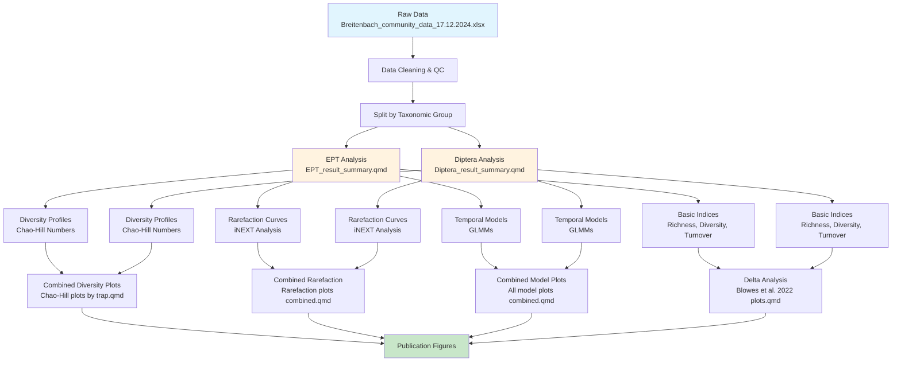

# Comparing species accumulation within taxonomically well- and poorly-resolved insect groups over 37-years

[](https://www.r-project.org/)

## Overview

This repository contains the complete analytical pipeline for examining the influence of "dark taxa" on biodiversity patterns in freshwater ecosystems. Using a unique 37-year quantitative dataset (1969-2006) of aquatic insects from the Breitenbach stream, we compare abundance, richness, turnover, and accumulation patterns between taxonomically well-resolved (EPT: Ephemeroptera, Plecoptera, Trichoptera) and poorly-resolved (Diptera) insect groups.

## Authors

**Nathan Jay Baker**, **Viktor Baranov**

---

## Table of Contents

- [Repository Structure](#repository-structure)
- [Data Requirements](#data-requirements)
- [Dependencies](#dependencies)
- [Installation](#installation)
- [Analysis Workflow](#analysis-workflow)
- [Key Analyses](#key-analyses)
- [Computational Requirements](#computational-requirements)
- [Troubleshooting](#troubleshooting)
- [Citation](#citation)
- [License](#license)
- [Contact](#contact)

---

## Repository Structure

```
├── Data/
│   └── Breitenbach_community_data_17.12.2024.xlsx   # Main dataset
├── Outputs/                                         # Saved analysis outputs
│   ├── ChoasDiversityProfilesDiptera.rds
│   ├── ChoasDiversityProfilesEPT.rds
│   ├── rarefaction_diptera.rds
│   ├── rarefaction_ept.rds
│   ├── chaohill_results_diptera.rds
│   ├── chaohill_results_ept.rds
│   └── Diptera_TD.rds
├── Plots/                                           # Generated figures
│   ├── All plots for publication/                   # Publication-ready figures
│   ├── Diptera/                                     # Diptera-specific plots
│   └── EPT/                                         # EPT-specific plots
├── Taxonomy information/                            # Taxonomic data exports
├── Breitenbach_2.0.Rproj                            # RStudio project file
├── HighstatLibV15.R                                 # Custom statistical functions
├── EPT_result_summary.qmd                           # Main EPT analysis
├── Diptera_result_summary.qmd                       # Main Diptera analysis
├── Chao-Hill plots by trap.qmd                      # Diversity profile analysis (Chao & Jost 2015 method)
├── Blowes et al. 2022 plots.qmd                     # Delta analysis (Blowes et al. 2022 method)
├── Rarefaction plots combined.qmd                   # Combined rarefaction plots
└── All model plots combined.qmd                     # Combined model visualizations
```

---

## Data Requirements

### Primary Dataset
- **File**: `Breitenbach_community_data_17.12.2024.xlsx`
- **Format**: Excel spreadsheet with species abundance data
- **Structure**: 
  - **Taxonomic columns**: `taxa_id`, `original_name`, `harmonized_name`, `validated_name`, `family`, `Order`
  - **Spatial column**: `trap` (trap locations: A, B, C, E, G, I, III, plus excluded traps)
  - **Temporal columns**: Annual abundance counts from `1969` to `2006` (38 years)
  - **Data type**: Integer abundance counts per species-trap-year combination
- **Rows**: Individual species records with yearly abundance data across all traps

### Data Collection Details
- **Study Period**: 37 years (1969-2006)
- **Sampling Method**: Weekly emergence trap sampling
- **Trap Design**: Stationary "greenhouse-like" emergence traps covering 12m stream length
- **Preservation**: Automatic collection in ethanol jars
- **Identification**: Morphological identification to species level
- **Spatial Replication**: 7 traps with observation periods ≥9 years (Traps A, B, C, E, G, I, III)

---

## Dependencies

### R Version
- **R**: 4.4.2 
- **Platform**: x86_64-w64-mingw32/x64

### Core Packages
```r
# Data manipulation and visualization
library(tidyverse)         # Data wrangling and ggplot2
library(patchwork)         # Combining plots
library(janitor)           # Data cleaning
library(scales)            # Scale formatting

# Statistical modeling
library(glmmTMB)          # Generalized linear mixed models
library(DHARMa)           # Model diagnostics
library(sjPlot)           # Model output tables
library(ggeffects)        # Model predictions
library(mgcv)             # GAMs for non-linearity testing
library(splines)          # Spline functions

# Biodiversity analysis
library(vegan)            # Community ecology analyses
library(iNEXT)            # Interpolation/extrapolation of diversity
library(SpadeR)           # Species richness estimation
library(mobr)             # Measurement of biodiversity
library(codyn)            # Community dynamics (turnover)
library(entropart)        # Entropy partitioning

# Data I/O
library(readxl)           # Reading Excel files
library(writexl)          # Writing Excel files

# Parallel processing
library(future.apply)     # Parallel computation

# Utilities
library(gridExtra)        # Grid arrangements
library(data.table)       # Fast data manipulation
```

### Custom Functions
- **File**: `HighstatLibV15.R`
- **Source**: Zuur, A. F. ., & Ieno, E. N. . (2021). The world of zero-inflated models: Volume 1.
- **Functions**: Data standardization (`MyStd()`), diagnostic plots (`Mydotplot()`)

---

## Installation

### 1. Clone Repository
```bash
git clone https://github.com/username/breitenbach-ecology.git
cd breitenbach-ecology
```

### 2. Install R Dependencies
```r
# Install CRAN packages
packages <- c("tidyverse", "patchwork", "janitor", "SpadeR", "vegan",
              "codyn", "mobr", "iNEXT", "readxl", "writexl", "INLA",
              "DHARMa", "glmmTMB", "sjPlot", "ggeffects", "scales",
              "splines", "future.apply", "gridExtra", "data.table",
              "entropart", "mgcv")

install.packages(packages)
```

### 3. Set Up Project
```r
# Open RStudio project
# File > Open Project > Breitenbach_2.0.Rproj

# Ensure HighstatLibV15.R is in working directory
source("HighstatLibV15.R")
```

---

## Analysis Workflow

The analysis follows a hierarchical approach with two main taxonomic groups:

### Phase 1: Data Preparation
1. **Data Import**: Load and clean community data from Excel
2. **Trap Harmonization**: Standardize trap naming conventions
3. **Data Transformation**: Convert to long format and aggregate by trap/species
4. **Quality Control**: Filter traps with sufficient temporal coverage (≥9 years)

### Phase 2: Biodiversity Metrics
1. **Basic Indices**: Species richness, Shannon diversity, Simpson diversity, evenness
2. **Chao Estimators**: Species richness estimation for individual communities
3. **Diversity Profiles**: Hill numbers (q = 0, 1, 2, 3) with confidence intervals
4. **Turnover Analysis**: Species appearance/disappearance rates between years
5. **Rarefaction Curves**: Individual-based accumulation curves using iNEXT

### Phase 3: Statistical Modeling
1. **Temporal Trend Analysis**: GLMMs for abundance, richness, and turnover
2. **Model Selection**: AIC-based comparison with various correlation structures
3. **Model Validation**: DHARMa residual diagnostics
4. **Predictions**: Generate fitted values with confidence intervals

### Phase 4: Comparative Analysis
1. **Cross-group Comparisons**: EPT vs. Diptera patterns
2. **Delta Analysis**: Following Blowes et al. (2022) methodology
3. **Visualization**: Publication-ready figures and combined plots

---

## Key Analyses

### Script Execution Order

#### Primary Analyses (Run in Parallel)
1. **`EPT_result_summary.qmd`** - Complete EPT analysis pipeline
2. **`Diptera_result_summary.qmd`** - Complete Diptera analysis pipeline

#### Secondary Analyses (Require Primary Outputs)
3. **`Chao-Hill plots by trap.qmd`** - Diversity profiles by trap
4. **`Blowes et al. 2022 plots.qmd`** - Delta correlation analysis
5. **`Rarefaction plots combined.qmd`** - Combined accumulation curves
6. **`All model plots combined.qmd`** - Combined temporal trends

### Core Analytical Methods

#### 1. Diversity Profile Analysis
- **Method**: Chao-Hill numbers with bootstrap confidence intervals
- **Orders**: q = 0 (richness), q = 1 (Shannon), q = 2 (Simpson)
- **Output**: Trap-specific and overall diversity profiles

#### 2. Temporal Trend Modeling
```r
# Example model structure
glmmTMB(Response ~ poly(year.std, degree) + (1 | ftrap) + ar1(0 + factor(year.std) | ftrap),
        family = distribution,
        data = dataset)
```
- **Distributions**: Negative binomial (abundance), Gamma (richness), Gaussian (turnover)
- **Random Effects**: Trap-level intercepts
- **Correlation**: AR(1) temporal autocorrelation
- **Predictors**: Standardized polynomials for non-linear trends

#### 3. Rarefaction Analysis
- **Method**: iNEXT interpolation/extrapolation
- **Type**: Individual-based curves (q = 0)
- **Standardization**: Common individual count for comparison

#### 4. Delta Analysis (Blowes et al. 2022)
- **Metrics**: ΔN (abundance), ΔS (richness), ΔS_rare (rarefied richness)
- **Correlations**: Pairwise relationships between delta metrics
- **Visualization**: Scatterplots with ellipses and trend lines

---

## Computational Requirements

### Hardware Recommendations
- **RAM**: Minimum 8GB, recommended 16GB+
- **CPU**: Multi-core processor (analysis uses parallel processing)
- **Storage**: ~500MB for outputs and figures

### Processing Notes
- **Parallel Processing**: Analysis uses `future.apply`
- **Memory Management**: Large objects cached as .rds files
- **Runtime**: Complete analysis ~30-60 minutes depending on hardware

### Computationally Intensive Steps
1. **Diversity Profile Calculation**: Bootstrap resampling (B = 1000)
2. **Rarefaction Curves**: iNEXT computations across all traps
3. **Chao-Hill Analysis**: Incidence-based diversity profiles
4. **Model Fitting**: GLMM estimation with AR(1) correlation

### Memory Optimization
```r
# Increase memory limits for parallel processing
options(future.globals.maxSize = 2000 * 1024^2)  # 2GB limit

# Clean environment between major steps
rm(large_objects)
gc()
```

---

## Troubleshooting

### Common Issues

#### 1. Memory Errors
**Problem**: "Cannot allocate vector of size X"
**Solution**:
```r
# Reduce number of parallel workers
plan(multisession, workers = 5)  # Instead of 15

# Increase memory limit
memory.limit(size = 16000)  # Windows only
```

#### 2. Package Installation Failures
**Problem**: Package compilation errors
**Solution**:
```r
# Install binary packages
install.packages("package_name", type = "binary")

# For glmmTMB issues
install.packages("glmmTMB", dependencies = TRUE)
```

#### 3. Model Convergence Issues
**Problem**: "Model failed to converge"
**Solution**:
```r
# Simplify correlation structure
# Remove ar1() term and refit
mod_simple <- glmmTMB(Response ~ year.std + (1 | ftrap),
                      family = family, data = data)
```

#### 4. File Path Issues
**Problem**: "Cannot find file"
**Solution**:
```r
# Check working directory
getwd()

# Use here package for portable paths
library(here)
data_path <- here("Data", "Breitenbach_community_data_17.12.2024.xlsx")
```

#### 5. Long Computation Times
**Problem**: Analysis takes too long
**Solution**:
```r
# Load pre-computed results instead
diversity_profiles <- readRDS("Outputs/ChoasDiversityProfilesEPT.rds")

# Reduce bootstrap replications for testing
B = 200  # Instead of 1000
```

### Data Issues

#### Missing Years/Traps
- Script automatically filters traps with <9 years of data
- Missing values handled with `na.rm = TRUE` in summary functions

#### Taxonomic Inconsistencies
- Names standardized using `validated_name` column
- Duplicates removed through `group_by()` and `summarise()`

---

## Flow Diagram



---

## Citation

### Manuscript
```
Baker, N.J., Jourdan, J., Pilotto, F., Wagner, R., Awad, J., Caruso, V.,
Chimeno, C., Höcherl, A., Ivković, M., Moser, M., & Baranov, V. (in prep.).
Comparing species accumulation within taxonomically well- and poorly-resolved
insect groups over 37-years.
```

### Code and Data
```
Baker, N.J., Baranov, V., et al. (2025). Breitenbach Freshwater Ecology Analysis.
GitHub repository: https://github.com/username/breitenbach-ecology
```

### Key References
- **Methodology**: Blowes, S.A. et al. 2022. Local biodiversity change reflects interactions among changing abundance, evenness, and richness. *Ecology* 103, e3820.
- **Statistical Functions**: Zuur, A. F. ., & Ieno, E. N. . (2021). The world of zero-inflated models: Volume 1.
- **Diversity Analysis**: Chao, A. & Jost, L. 2015. Estimating diversity and entropy profiles via discovery rates of new species. *Methods Ecol. Evol.* 6, 873–882.

---

## License

This project is licensed under the MIT License - see the [LICENSE](LICENSE) file for details.

### Data Usage
- Raw data usage requires citation of the original Wagner et al. (2011) study
- Processed outputs available under MIT license with attribution

---

## Contact

**Primary Contact**: Nathan Jay Baker
**Email**: Nathan93Baker@gmail.com
**ORCID**: https://orcid.org/0000-0001-7948-106X

**Senior Author**: Viktor Baranov
**Email**: baranowiktor@gmail.com
**ORCID**: https://orcid.org/0000-0001-6441-4016

### Contributing
We welcome contributions and questions. Please:
1. Open an issue for bugs or feature requests
2. Fork the repository for contributions
3. Follow existing code style and documentation standards

### Support
- Check [Issues](https://github.com/username/breitenbach-ecology/issues) for common problems
- Create a new issue with reproducible example for help
- Include session info (`sessionInfo()`) when reporting bugs

---

## Acknowledgments

- Breitenbach stream research station for long-term data collection

